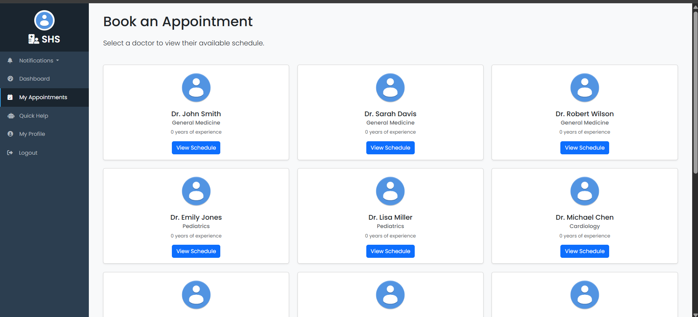

# Smart Healthcare Management System

## Project Overview

The **Smart Healthcare Management System** is a full-featured web application developed to address the growing need for accessible remote healthcare. The platform empowers patients to receive timely medical advice from the comfort of their homes while providing doctors with the tools to manage virtual consultations efficiently.

Key functionalities include a role-based system for patients, doctors, and administrators; a dynamic appointment scheduling system; and a secure, real-time consultation room with live chat. A standout feature is the "Smart Quick Help," a guided symptom checker that offers preliminary advice. The entire application is containerized using Docker and Docker Compose, demonstrating a modern, full-stack approach to building scalable and reliable solutions.

---

## Key Features

- **Role-Based User System:** Secure authentication and authorization for three distinct roles: Admin, Doctor, and Patient.
- **Admin Dashboard:** A comprehensive dashboard displaying site-wide analytics, user statistics, and management controls.
- **Secure Doctor Creation:** A dedicated, admin-only interface for securely creating and vetting new doctor accounts.
- **Doctor Dashboard:** An intuitive interface for doctors to manage patient help requests, view upcoming appointments, and set their availability.
- **Patient Dashboard:** A personalized space for patients to book appointments, view their medical history, and manage their profile.
- **Real-Time Consultation Room:** A secure, live chat system built with Django Channels and WebSockets for seamless patient-doctor communication.
- **Smart "Quick Help" System:** An interactive, decision-tree-based symptom checker that provides preliminary advice to patients.
- **Dynamic Appointment Scheduling:** A complete system allowing patients to view doctor schedules and book available time slots.

---

## Technology Stack

- **Backend:** Django, Django Channels
- **Frontend:** HTML5, CSS3, JavaScript, Bootstrap 5
- **Database:** PostgreSQL
- **Asynchronous Server:** Daphne
- **Channel Layer / Message Broker:** Redis
- **Containerization:** Docker, Docker Compose

---

## Database Schema (ERD)

The following diagram illustrates the database schema, including all models and their relationships.


---

## Setup and Installation

### Prerequisites

- Docker
- Docker Compose

### Running the Project

1.  **Clone the Repository**
    ```bash
    git clone [https://github.com/Adhithya2411/Smart-Healthcare-Management-System.git](https://github.com/Adhithya2411/Smart-Healthcare-Management-System.git)
    cd Smart-Healthcare-Management-System
    ```

2.  **Create and Configure the Environment File**
    -   Create a file named `.env` in the project's root directory.
    -   Copy the contents of `.env.example` into it and fill in your desired database credentials and a new Django secret key.

3.  **Build and Run the Docker Containers**
    Use Docker Compose to build the images and run the services in the background:
    ```bash
    docker-compose up -d --build
    ```

4.  **Create a Superuser (Admin)**
    The first time you run the project, create a superuser to access the admin dashboard:
    ```bash
    docker-compose exec web python manage.py createsuperuser
    ```

5.  **Access the Application**
    -   **Main Application:** [http://localhost:8000](http://localhost:8000)
    -   **pgAdmin (Database GUI):** [http://localhost:5050](http://localhost:5050)


## Screenshots

<details>
<summary>Click to expand and see application screenshots</summary>

### Landing Page
*The public-facing landing page for new visitors.*


### Admin Dashboard
*Provides a high-level overview of site analytics and user management controls.*


### Doctor Dashboard
*The central hub for doctors to manage pending requests, active cases, and upcoming appointments.*


### Patient Dashboard
*Allows patients to submit help requests, view their history, and see answered prescriptions.*


### Find a Doctor
*A list of all available doctors on the platform, filterable by specialty.*


### Doctor's Schedule
*After selecting a doctor, patients can view and book available time slots.*


### Live Consultation Room
*A secure, real-time chat interface for patient-doctor consultations.*


### Smart Quick Help
*An interactive symptom checker to provide users with preliminary guidance.*


</details>